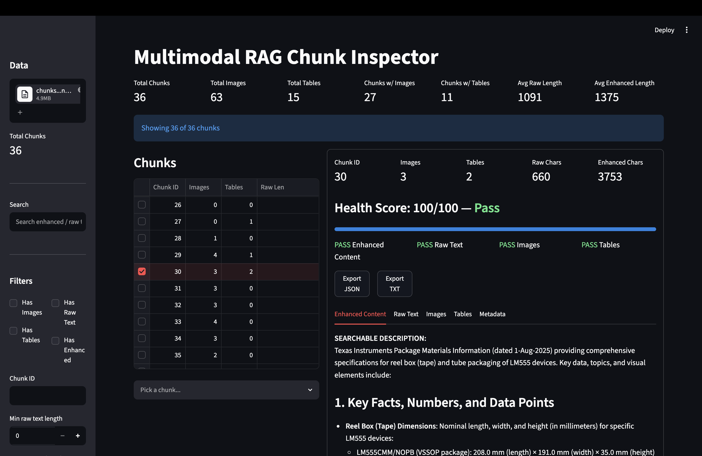
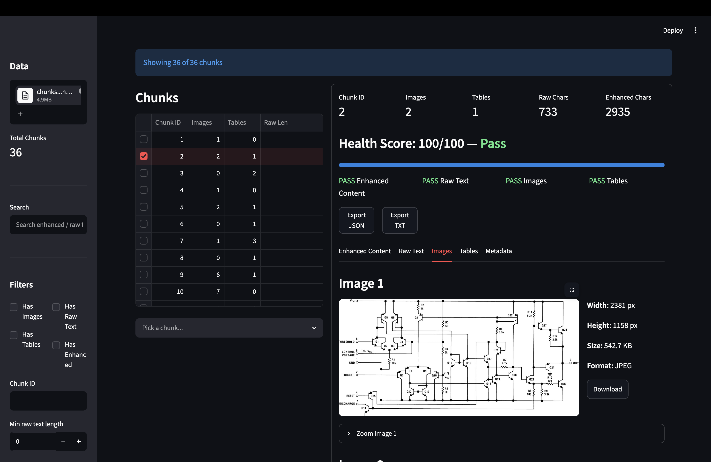
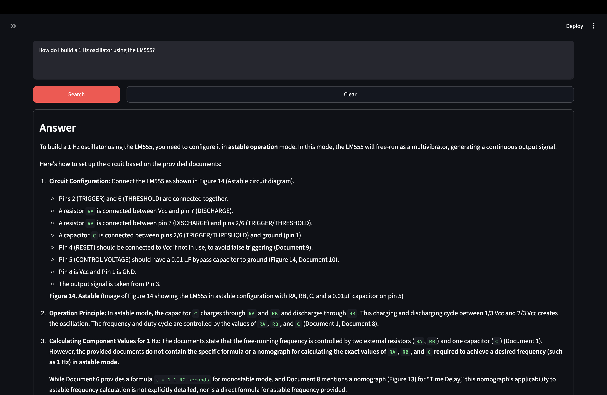
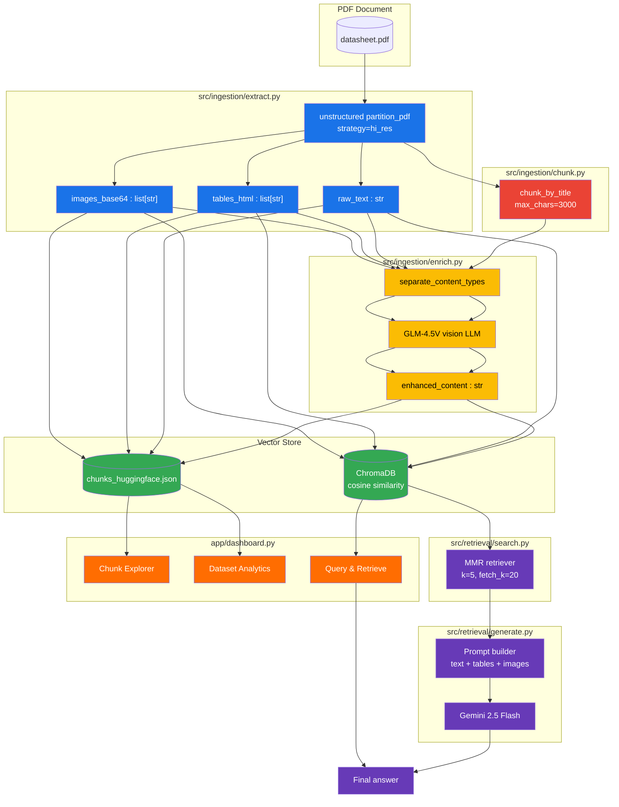

# Multimodal RAG

A production-ready multimodal RAG pipeline that ingests PDFs (text, tables, images), creates AI-enhanced searchable summaries, stores them in a vector database, and answers queries with full multimodal context.

---
<div align="center">
  
[](https://www.python.org/)
[](https://www.langchain.com/)
[](https://www.trychroma.com/)
[](https://streamlit.io/)
[](https://ai.google.dev/)
[](https://huggingface.co/)
 
</div>

## Screenshots

| Chunk Explorer | Dataset Analytics | Query & Retrieve |
|---|---|---|
|  |  |  |

---
## Architecture

The pipeline handles **text**, **images**, and **tables** at every stage — from PDF extraction through retrieval and answer generation. Below is how each modality flows through the system.

### Multimodal Data Flow



### How each modality is handled

| Modality | Extraction | Storage | Retrieval | Display |
|---|---|---|---|---|
| **Text** | `partition_pdf` extracts raw OCR text from each element | Stored as `raw_text` string inside chunk metadata | Injected into the LLM prompt as-is | Shown in a scrollable text area with word/char counts |
| **Tables** | `infer_table_structure=True` produces HTML `<table>` markup | Stored as `tables_html` list inside chunk metadata | Parsed with `pandas.read_html()` and serialized back to HTML for the prompt | Rendered as interactive DataFrames; raw HTML available in expander |
| **Images** | `extract_image_block_types=["Image"]` captures images as base64 payloads | Stored as `images_base64` list inside chunk metadata | Attached to the Gemini message as `image_url` blocks with `data:image/jpeg;base64,...` | Decoded via PIL, displayed with dimensions, format, download, and zoom |

### Two pipelines, one vector store

- **Ingestion pipeline** (`scripts/ingest.py`): PDF → extract → chunk → AI enrich → ChromaDB + JSON
- **Retrieval pipeline** (`scripts/query.py`): query → embed → MMR search → multimodal prompt → Gemini answer
- **Dashboard** (`app/dashboard.py`): browse chunks from JSON, or query live via the vector store

---

## Project Structure

```
multimodal-rag/
├── config/
│   ├── __init__.py
│   └── settings.py          # environment variables, model names, tunables
│
├── src/
│   ├── embed.py             # shared embedding model (Granite)
│   ├── ingestion/           # storing pipeline
│   │   ├── extract.py       #   PDF -> unstructured elements
│   │   ├── chunk.py         #   elements -> semantic chunks
│   │   ├── enrich.py        #   AI-enhanced summary generation
│   │   ├── export.py        #   chunks -> JSON file
│   │   └── pipeline.py      #   orchestrator + ChromaDB creation
│   └── retrieval/           # query pipeline
│       ├── search.py        #   vector store loading, MMR retrieval
│       └── generate.py      #   multimodal answer generation (Gemini)
│
├── app/
│   └── dashboard.py         # Streamlit inspection & query UI
│
├── scripts/
│   ├── ingest.py            # CLI entry point: PDF -> vector store
│   └── query.py             # CLI entry point: query -> answer
│
├── tests/                   # test stubs
├── notebooks/               # exploration notebooks
├── data/                    # source PDFs
├── dbv1/                    # persisted ChromaDB (production)
│
├── pyproject.toml
├── requirements.txt
└── README.md
```

---

## Prerequisites

- **Python 3.13+**
- **System dependencies** for `unstructured` PDF parsing:
  ```bash
  # macOS
  brew install poppler tesseract libmagic pandoc

  # Ubuntu / Debian
  sudo apt-get install -y poppler-utils tesseract-ocr libmagic1 pandoc
  ```

---

## API Keys

This pipeline uses three services. Each is free to sign up:

### 1. HuggingFace Token

Used for the embedding model (`Granite`), the vision LLM (`GLM-4.5V`), and the enhancement summariser.

1. Go to [huggingface.co/settings/tokens](https://huggingface.co/settings/tokens)
2. Click **New token** → give it a name → select **Read** role
3. Copy the token (starts with `hf_`)

### 2. Google Gemini API Key

Used for answer generation (`gemini-2.5-flash`).

1. Go to [aistudio.google.com/apikey](https://aistudio.google.com/apikey)
2. Click **Create API Key** → follow the Google Cloud project flow
3. Copy the key

### 3. Groq API Key (optional)

Used if you want to swap the generation model to a Groq-hosted model.

1. Go to [console.groq.com/keys](https://console.groq.com/keys)
2. Click **Create API Key**
3. Copy the key (starts with `gsk_`)

---

## Setup

```bash
# 1. Clone the repository
git clone <repo-url> multimodal-rag
cd multimodal-rag

# 2. Create and activate a virtual environment
python3.13 -m venv .venv
source .venv/bin/activate

# 3. Install dependencies
pip install -r requirements.txt

# 4. Create the environment file
HF_TOKEN="hf_your_huggingface_token_here"
GEMINI_API_KEY="your_gemini_api_key_here"
GROQ_API_KEY="gsk_your_groq_key_here"


# 5. Verify everything loads
python -c "from config.settings import HF_TOKEN; print('Config OK')"
python -c "from src.embed import load_embedding_model; print('Embedding import OK')"
```
---

## Usage

### 1. Ingest a PDF

Extract text, tables, and images, create AI summaries, and store in ChromaDB:

```bash
python -m scripts.ingest                        # uses data/datasheet.pdf
python -m scripts.ingest path/to/document.pdf   # custom PDF
```

This produces:
- `chunks_huggingface.json` — all chunks with enhanced content, raw text, tables, and base64 images
- `dbv2/chroma_db/` — vector store for retrieval

### 2. Query the vector store

Load the vector store, retrieve relevant chunks, and generate a multimodal answer:

```bash
python -m scripts.query
```

### 3. Launch the inspection dashboard

```bash
streamlit run app/dashboard.py
```

The dashboard has four pages:

| Page | Purpose |
|---|---|
| **Chunk Explorer** | Browse all chunks, inspect metadata, images, tables, health scores |
| **Compare Chunks** | Side-by-side comparison of any two chunks |
| **Dataset Analytics** | Interactive histograms and top-20 lists |
| **Query & Retrieve** | Run queries against the vector store, view answer + referenced chunks |

---

## Configuration

All tunable parameters are in `config/settings.py`:

| Setting | Default | Purpose |
|---|---|---|
| `EMBEDDING_MODEL` | `ibm-granite/granite-embedding-97m-multilingual-r2` | Embedding model |
| `GENERATION_MODEL` | `gemini-2.5-flash` | Answer generation LLM |
| `CHROMA_PERSIST_DIR` | `dbv1/chroma_db` | Vector store path |
| `RETRIEVAL_K` | `5` | Number of chunks to retrieve |
| `CHUNK_MAX_CHARACTERS` | `3000` | Max characters per chunk |
| `ENHANCEMENT_MODEL` | `zai-org/GLM-4.5V` | Vision model for AI summaries |

---

## Key Features

- **PDF ingestion** with full multimodal extraction (text, tables, images) via `unstructured`
- **AI-enhanced chunk summaries** using a vision language model
- **Vector storage** in ChromaDB with cosine similarity
- **Multimodal retrieval** — answers include context from text, tables, and images
- **Inspection dashboard** — debug every chunk's content, health score, and quality metrics
- **Chunk Health Score** — 0-100 rating based on content completeness
- **All failures handled gracefully** — missing fields, malformed base64, parsing errors
